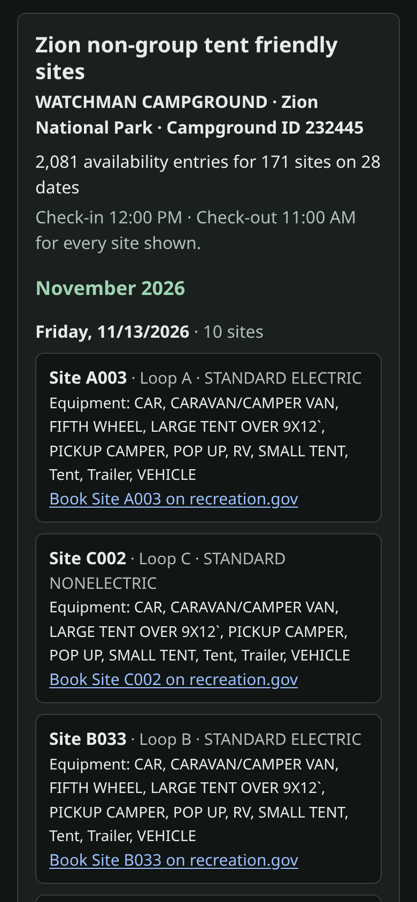

<div align="center">
  
</div>

# Campertron

Campertron watches [recreation.gov](https://www.recreation.gov) for campsites that open up at the campgrounds you care about.

Popular campgrounds are booked months ahead, but people cancel all the time, and those openings are usually gone again within minutes. Campertron checks for you and shows matching sites in its desktop GUI, in a terminal window, or in your web browser, with optional notifications by email or as push notifications with [ntfy](https://ntfy.sh).

It runs on Windows, macOS and Linux, or as a Docker container. Campertron is free and open source (MIT license). [Quality and release process](#quality-and-release-process) describes how it is built, tested and released.

## What you can do with it

- Search one or many campgrounds at once. Each search is a small settings file, and Campertron runs all of them together.
- Narrow the results to what you need:
  - dates: a number of days or months ahead, specific dates, a date range, or up to a date
  - days of the week
  - group size
  - equipment, such as a tent or a trailer
  - site features, such as shade or campfires allowed
  - site types and specific sites
  - a minimum number of consecutive nights
- Get the results in the terminal, as a web page in your browser, by email, or as a push notification on your phone with ntfy. In email or ntfy mode Campertron keeps running, waits a minute between checks and notifies you whenever it finds openings it hasn't reported before.
- In the desktop app: look up any campground's ID, phone number, description, directions and fees, create and edit your searches and settings, run your searches and see what they found, check your current configuration and refresh the campground list.

## Two programs: Console and GUI

Campertron comes as two separate downloads. They share the same settings and search files, so you can use either one or both.

| | **CampertronConsole** | **CampertronGUI** |
|---|---|---|
| What it does | Searches recreation.gov for open campsites and shows the matches or sends them by email or ntfy | Lets you browse campgrounds by park, city or state, see their details, create and edit your searches and settings, run your searches once and see what they found, check your current configuration and refresh the campground list |
| Use it to | run your searches and get notified, also around the clock | find the campground a search needs, set up your searches and check them right away |
| How it runs | in a terminal window, or as a Docker container | as a desktop window |

The GUI's **Results** tab searches when you ask it to and shows the results in the window. It never sends email or ntfy notifications and never runs on its own; to be notified about new openings around the clock, use the console's email or ntfy mode.

## Screenshots

**CampertronConsole** opens with a short menu. Use the arrow keys and press Enter.


**Search** runs every search you have set up. It first lists what it is searching, then the open sites it found: grouped by date (or by site when you ask for consecutive nights), each with a link to book it on recreation.gov, followed by a calendar with the open days marked and a one-line summary.


With `outputTo: HtmlFile`, **Search** opens the results as one web page instead: a section for each search, the open sites grouped by date (or by site when you ask for consecutive nights), and a link to book each site. The page follows your system's light or dark theme and also fits a phone screen. Email output sends the same kind of page.




**View Config** shows where your settings files are stored, where results go, and which versions of Campertron and .NET you are running. CampertronGUI shows the same values under **Settings** > **System** (below).


> **Note:** the GUI's **Current configuration** and **Campground data** under **Settings** > **System**, and the words **Enabled (autoRun)** and **Not enabled**, are new in version 0.1.1; version 0.1.0 doesn't have them.

**CampertronGUI** has four tabs: **Searches**, **Results**, **Settings** and **Campgrounds**. It opens on **Searches**, which lists your search files, each **Enabled (autoRun)** or **Not enabled**, and edits them: every setting of a search, the dates as a list, the campground chosen from a list of every reservable campground (search by name, city, state, park or ID) or by its exact ID, and the filters as check lists of that campground's own equipment types, campsites, attributes and campsite types (see [How filters match](#how-filters-match)). **Create search** makes a new search from the example and **Save as** saves a copy under a new name; neither writes over an existing file, and the GUI never deletes a file.


The **Results** tab lists your search files with a check box each. The searches that are **Enabled (autoRun)** and can be searched are selected by default; a search that is **Not enabled** is listed unselected and runs only if you select it, which doesn't change the file. A file that can't be searched, or that has unsaved changes in the Searches tab, says why. Nothing runs until you choose **Start**: it searches the selected files once, with the console's own search, and shows its progress; **Cancel** stops it. The results show each search's status, its counts and which months were checked (a month recreation.gov didn't answer is listed as not checked, never as fully booked), then the open sites grouped by date, or by site with their dates for consecutive nights. Choose a site to open its booking page on recreation.gov or copy its ID or link. If recreation.gov limits the requests, the search stops, keeps what it found and **Start** waits five minutes. The Results tab never changes your files, never sends email and doesn't use `Camp.History`, so it always shows every open site that matches right now.


**Settings** has two tabs of its own. **Campertron** edits `General.yaml`, `Email.yaml` and `Ntfy.yaml` (see [Notifications with ntfy](#notifications-with-ntfy)): it shows what each setting does and any problem, previews exactly the lines a save changes (never the password) and keeps your comments and a backup of the previous version. It never saves settings that email or ntfy mode would refuse to start with: a value that isn't valid can't be saved, and `outputTo` can be set to `Email` or `Ntfy` only once `Email.yaml` (or `Ntfy.yaml`) is ready and at least one search is **Enabled (autoRun)** and has a campground, with a message that says what to fix. If your settings already use `Email` or `Ntfy` without such a search, the same message appears as a warning. In the **Searches** tab, a change that would leave email or ntfy mode without a search to check (for example disabling your last enabled search) shows a warning, but you can still save it. In lists such as the email recipients, empty rows are ignored and spaces around a value are removed. For the email password, **SMTP password file (recommended)** sets `smtpPasswordFile`, the path of a file that holds the password, and explains the order email mode takes the password from; the GUI never opens that file. **Password (plain text)** is `smtpPassword`, hidden unless you choose **Show password**. A password in the password file or in `CAMPERTRON_EMAIL_PASSWORD` is never read or shown (see [The email password](#the-email-password)).

Messages are styled by how serious they are (new in version 0.2.0): an **error** (red, a cross in a circle) means the settings can't be saved or Campertron would refuse to start, a **warning** (amber, an exclamation mark in a triangle) means it works but needs your attention, and **information** (blue, an *i* in a circle) is neutral. The shape of the icon and the word Error, Warning or Info say the same for anyone who can't tell the colors apart, and screen readers read the severity too.

CampertronGUI also checks the password file (`smtpPasswordFile`) and ntfy's token file (`tokenFile`) on this computer, without ever opening them: it says when the file doesn't exist, is a folder, is empty or too large, or can't be read by you (an error while email, or ntfy, is in use, otherwise a warning), and warns when other users can read it, with the fix (`chmod 600`). None of these stops you from saving, because the file may only exist where Campertron runs, such as a Docker secret in a container.


**System** has three parts:

- **Theme** chooses how the GUI looks: **System**, the default, follows your computer's light or dark setting, while **Light** and **Dark** always use that theme. Your choice applies at once and is kept for the next start in `CampertronGUI/preferences.json`, next to the settings folder (see [First start](#first-start)). It is not part of your settings files and doesn't change the console.
- **Current configuration** shows the same eight values as the console's **View Config**: the version, the settings and cache folders, where results go, how many search files there are, when the campground list was last refreshed, and the operating system and .NET version. It only shows them: it never changes a file, and it never shows the contents of your search files or anything of `Email.yaml` or `Ntfy.yaml`. **Copy** puts the values on the clipboard as text, and **Open settings folder** shows the settings folder in your file manager.
- **Campground data** shows when the campground list was last refreshed, and **Refresh campground data…** downloads the latest one, as the console's **Refresh Ridb Data (slow)** does (see [Keep the campground list up to date](#keep-the-campground-list-up-to-date)).


**Campgrounds** is the campground lookup, with a tab for each way to look: **By Park**, **By City** and **By State**. Pick a park, a city or a state, then a campground, and it shows the campground's ID and details. Each campground in a list shows its location and ID, so campgrounds with the same name are easy to tell apart. The ID is what you put in a search: select it, or press **Copy ID**. In a list you can also type the first letters of a name to jump to it.


The screenshots show the dark theme. While the GUI prepares its campground data (the first start unpacks it), it shows its progress; if a settings file can't be read, it shows the problem and the settings folder, and **Try again** starts again after you have fixed or deleted the file.

## Download and run

1. Open the [latest release](https://github.com/ShaunAnthonyHathaway/Campertron/releases/latest) and download the archive for your computer (see the table below).
2. Extract it. You get one folder with everything inside.
3. Start the program from that folder:
   - **Windows:** double-click `CampertronConsole.exe` or `CampertronGUI.exe`.
   - **macOS and Linux:** open a terminal in the folder and run `./CampertronConsole` or `./CampertronGUI`.

You don't need to install .NET or anything else. Each download includes everything it needs.

### Which file do I need?

Archive names follow the pattern `campertron-<program>-<version>-<platform>`: for example `campertron-console-0.1.1-win-x64.zip`. Pick `console` or `gui`, then your platform:

| Your computer | Platform in the file name | File type |
|---|---|---|
| Windows, most PCs (64-bit Intel or AMD) | `win-x64` | `.zip` |
| Windows on ARM (for example Snapdragon laptops) | `win-arm64` | `.zip` |
| Windows, 32-bit | `win-x86` | `.zip` |
| Mac with Apple silicon (M1 or newer) | `osx-arm64` | `.tar.gz` |
| Mac with an Intel processor | `osx-x64` | `.tar.gz` |
| Linux, 64-bit Intel or AMD | `linux-x64` | `.tar.gz` |
| Linux, 64-bit ARM (for example Raspberry Pi with a 64-bit OS) | `linux-arm64` | `.tar.gz` |
| Linux, 32-bit ARM (for example Raspberry Pi with a 32-bit OS) | `linux-arm` | `.tar.gz` |

On Windows, extract a `.zip` from File Explorer (right-click, **Extract All**). On macOS and Linux, extract a `.tar.gz` in a terminal, for example:

```sh
tar -xzf campertron-console-0.1.1-linux-x64.tar.gz
cd campertron-console-0.1.1-linux-x64
./CampertronConsole
```

CampertronGUI needs a graphical desktop. On macOS it is a plain program rather than an app bundle, so start it from Terminal.

### System requirements

Each download includes everything it needs; you don't install .NET separately. Campertron is built on .NET 11:

- **Intel or AMD processors** (`win-x64`, `win-x86`, `linux-x64`, `osx-x64` and the `linux/amd64` container) must support the x86-64-v2 instruction set (SSE4.2 and POPCNT). Practically every PC sold in the last decade does; some very old processors don't, and on those the program stops at startup with a message that the CPU is missing required instruction sets.
- **ARM processors** (`win-arm64`, `linux-arm64`, `linux-arm`, `osx-arm64`): the x86-64-v2 requirement doesn't apply. Older 64-bit ARM boards, such as Raspberry Pi 3 and 4, may start a little more slowly.
- **Docker:** the container image is based on Ubuntu 26.04.

All eight platforms in the table above are available.

Before every release, CI starts `linux-x64`, `linux-arm64`, `win-x64`, `win-arm64`, `osx-x64` and `osx-arm64` natively: the console's clean install and the GUI's built-in smoke test (window, data, clean close). `win-x86` runs the same tests as a 32-bit process on 64-bit Windows, not on a 32-bit system, and `linux-arm` is built from the same sources but not started. Avalonia, the GUI's UI framework, lists 32-bit Windows (`win-x86`) as a commercially supported platform only and doesn't list 32-bit ARM Linux desktops (`linux-arm`). Both container images are run in CI before publication.

### If your computer blocks the program

The programs are not code-signed, so your system may warn you the first time:

- **Windows:** SmartScreen may show a warning. Choose **More info**, then **Run anyway**.
- **macOS:** if Gatekeeper refuses to open the program, remove the download quarantine from the extracted folder and try again:

  ```sh
  xattr -dr com.apple.quarantine campertron-console-0.1.1-osx-arm64
  ```

## Set up your searches

### First start

The first time either program starts, it creates two folders for its files:

| System | Settings (`CampertronConfig`) and cache (`CampertronCache`) are in |
|---|---|
| Windows | `C:\Users\<you>\AppData\Local` |
| macOS | `~/Library/Application Support` |
| Linux | `~/.local/share` (or `$XDG_DATA_HOME` if you set it); Campertron creates the folder if it doesn't exist yet |

You can always check the exact location with **View Config** in the console menu, or in CampertronGUI under **Settings** > **System** > **Current configuration**, where **Open settings folder** opens it. CampertronGUI also keeps its theme choice there, in its own folder `CampertronGUI` (`preferences.json`), apart from your settings.

The settings folder holds:

- `General.yaml`: general options, including where results go.
- `Email.yaml`: your email settings, used only for email notifications.
- `Ntfy.yaml` (optional, only if you create it): your ntfy settings, used only for ntfy notifications (see [Notifications with ntfy](#notifications-with-ntfy)).
- Your searches: one `.yaml` file per search, with any file name.
- `RecreationDotOrg.db`: Campertron's copy of the recreation.gov campground list, which the GUI and the searches use.
- `Camp.History`: what email and ntfy mode have already reported (see [Choose where results go](#choose-where-results-go)). It appears when Campertron first records an opening, after an email or ntfy notification about it has been delivered.

The first time you choose **Search** in the console without any search files in the settings folder, it creates an example, `ZionConfig.yaml`, which looks for tent sites at Watchman Campground in Zion National Park. Use it as a starting point. Email mode doesn't create it: without a search file it stops with an error (new in version 0.2.0; versions 0.1.0 and 0.1.1 create and check the example when email mode starts). If you already have search files but none of them is enabled (`autoRun: true`), the console searches nothing and says so; it never changes or replaces your search files. CampertronGUI never creates the example by itself.

### Create a search

In CampertronGUI:

1. Open the **Searches** tab, type a name under **New search file** (for example `My trip`) and choose **Create search**. Campertron creates `My trip.yaml` in the settings folder from the example search. A new search starts **Not enabled**: the **Results** tab runs it when you select it, and the console runs it once you enable it.
2. Under **Campground**, type part of the campground's name, city, state or park (or its ID) and choose **Use the selected campground**, or enter its exact ID.
3. Set the name, the dates, the days of the week and any filters: check the equipment types, campsites, attributes and campsite types you want from the campground's own lists, or type a value. Problems are shown next to each setting, and the preview shows exactly the lines that will change.
4. Check **Enabled (autoRun)** and choose **Save**. The console runs only enabled searches (`autoRun: true`): its **Search** reads the search files each time you choose it, and email mode reads them once, when it starts, and then checks the enabled searches every minute, so restart email mode after you change a search. The **Results** tab selects enabled searches by default.
5. To try the search right away, open the **Results** tab, select it and choose **Start**. This works for searches that are not enabled too, and changes nothing in the file. CampertronGUI never runs a search just because it starts.

Or by hand: copy `ZionConfig.yaml` (or one of the [example searches](examples/0.1)) to a new file in the settings folder, for example `MyTrip.yaml`, give it a `displayName`, set `campgroundID` to the campground's ID (shown in the GUI's **Campgrounds** tab), adjust the dates and filters, and keep `autoRun: true`. Edits made in the GUI keep your comments and leave the previous version in `<name>.yaml.bak`.

The [examples page](examples/0.1) explains every setting in a search file, `General.yaml`, `Email.yaml` and `Ntfy.yaml`.

### How filters match

A search has eight filter lists: `includeEquipment`, `excludeEquipment`, `includeSites`, `excludeSites`, `includeAttributes`, `excludeAttributes`, `includeCampsiteType` and `excludeCampsiteType`. An include list keeps a campsite that matches **any** of its values; an exclude list leaves out a campsite that matches **any** of its values; an empty list filters nothing. Attributes are written `Name:Value`, for example `Shade:Yes`.

`filterMatching` says how a value matches:
- **`Exact`**: the value must equal the campsite's equipment type, campsite name, attribute or campsite type. New searches use it.
- **`Contains`**: what a search file without `filterMatching` uses. A campsite type matches when it contains the value (`GROUP` matches `GROUP STANDARD NONELECTRIC`); an equipment or attribute value matches when it contains the campsite's (`RV/MOTORHOME` matches a campsite that allows `RV`, and `Shade:Yes` also matches a campsite whose `Shade` is blank).

Campsite names always match exactly, and upper and lower case, spaces and punctuation always count. The GUI's **Matching** choice sets `filterMatching` and shows what each value matches; a value the campground doesn't have is kept and shown under its list.

### Choose where results go

Set `outputTo` in `General.yaml`:

| `outputTo` | What happens |
|---|---|
| `Console` (default) | Choose **Search** in the menu. Results appear in the terminal. Every Search shows all the open sites that match right now, including ones you have seen before. |
| `HtmlFile` | Choose **Search** in the menu. The results of all your searches open as one web page in your browser. Every Search shows all the open sites that match right now, including ones you have seen before. |
| `Email` | Campertron starts searching right away, without the menu. It reads your search files once, when it starts, keeps running, checks the enabled searches every minute and emails you when it finds openings it hasn't reported before: one email per search, with the results in the email (see **What an email contains** below). Restart it after you change a search. Fill in `Email.yaml` first: email mode checks it when it starts and stops with a message that says what is missing. If, when it starts, there is no search file, or no search is enabled and has a campground, email mode doesn't keep running and creates no file: it writes one error that says what to fix and exits with code 1 (see [Logs, colors and problems](#logs-colors-and-problems)). This is new in version 0.2.0; versions 0.1.0 and 0.1.1 keep running instead and check 0 searches every minute, or, without a search file, create and check the example search. With ntfy turned on in `Ntfy.yaml`, it uses ntfy too. |
| `Ntfy` | Like `Email`, but it notifies you only with ntfy: one push notification for each search with new openings. Fill in `Ntfy.yaml` first (see [Notifications with ntfy](#notifications-with-ntfy)); `Email.yaml` isn't used. New in version 0.2.0. |

Email and ntfy mode remember what they have already reported in the `Camp.History` folder inside the settings folder. A site and date you were notified about is not reported again, even after a restart and even if it is booked and later becomes free again. Campertron records a site and date only after a notification about it was delivered: if an email or an ntfy notification can't be sent, Campertron stops with an error after the check, and the openings it has not delivered are not recorded, so the next run reports them again. With email and ntfy both on, an opening is recorded once either of them delivered it (see [Notifications with ntfy](#notifications-with-ntfy)). To start over and be notified about everything that is open, delete the `Camp.History` folder while Campertron is not running. Campertron never deletes it. Console and HtmlFile searches, and the GUI's Results tab, don't use this folder.

**What an email contains.** Each email shows one search's results in the email itself, laid out like the results web page: the campground, how many sites and dates are open, the check-in and check-out times, the open sites grouped by month and date, and for each site its loop, type, allowed equipment and a link that books it on recreation.gov. A plain-text version is included for mail apps that don't show formatted email, and the email follows your mail app's light or dark appearance where the app supports that. When a search finds so many openings that the email would be too large to show in full (Gmail cuts off emails larger than about 102 KB; this happens from about a hundred open sites in one search), the email instead says how many openings there are and attaches the full results as `Campertron-results-YYYY-MM-DD.html`: open that file in your web browser to see every site and booking link. This is new in version 0.2.0; versions 0.1.0 and 0.1.1 send the results page as the email and attach the same page to every email.

Ready-made settings for each way to be notified (email, with the password as plain text, in a file or in a variable; ntfy, with or without an access token; both together) and a Docker Compose file are in [examples/notifications](examples/notifications).

`Email.yaml` uses your email provider's SMTP settings (the connection is always encrypted):

```yaml
smtpServer: smtp.example.com
smtpPort: 587
smtpUsername: you@example.com
smtpPassword: your-password-or-app-password
sendToAddressList:
- you@example.com
sendFromAddress: you@example.com
```

Many providers require an app password for this instead of your normal password. To keep the password out of `Email.yaml`, see [The email password](#the-email-password).

### The email password

Campertron needs your SMTP password only in email mode. It can take it from three places, and uses the first one you set up:

1. **A password file** named by `smtpPasswordFile` in `Email.yaml`. The whole file is the password. This suits Docker secrets and read-only mounts.
2. **The environment variable `CAMPERTRON_EMAIL_PASSWORD`.**
3. **`smtpPassword` in `Email.yaml`**, as before: the password as plain text in that file.

If the one you set up can't be used, email mode doesn't try the next one: it stops right after it starts with an error that says what to fix and exits with code 1, before it searches or sends anything. That happens when the password file is missing, unreadable, empty, a folder, too large or not plain text, or when `CAMPERTRON_EMAIL_PASSWORD` is set but empty. To use the next source instead, remove `smtpPasswordFile` from `Email.yaml`, or unset the variable. The password file and the variable are new in version 0.2.0: version 0.1.1 refuses an `Email.yaml` that has `smtpPasswordFile` and ignores the variable.

```yaml
smtpServer: smtp.example.com
smtpPort: 587
smtpUsername: you@example.com
smtpPassword: ''
smtpPasswordFile: /run/secrets/smtp_password
sendToAddressList:
- you@example.com
sendFromAddress: you@example.com
```

The password file:

- Write its full path, such as `/run/secrets/smtp_password` or `C:\Users\you\campertron-smtp.txt`. A relative path is refused.
- It holds only the password, as UTF-8 text without a byte-order mark. One line break at its end is allowed and is not part of the password. Nothing else is removed, so spaces count. More than one line, an empty file and a file larger than 4,096 bytes are refused.
- Email mode reads it once, when it starts. Restart email mode after you change the password. Campertron never writes, copies, moves or deletes the file or changes its permissions. A link is followed to the file it points to.
- Let only the user that runs Campertron read it, for example with `chmod 600` on Linux and macOS.

The environment variable is used exactly as it is set: nothing is trimmed, and set but empty is an error. Anyone who can inspect the process or the container can read its environment, for example with `docker inspect`, so prefer the password file.

To move the password out of `Email.yaml` without leaving it in your shell history, type it at a prompt that doesn't show it (bash):

```sh
umask 077
IFS= read -rs -p "SMTP password: " PW && printf '%s' "$PW" > ~/campertron-smtp-password && unset PW
```

Then set `smtpPasswordFile` to the file's full path and clear `smtpPassword` (`smtpPassword: ''`): in CampertronGUI, enter the path under **Settings** > **Campertron** > **Email.yaml** > **SMTP password file (recommended)**, save, and clear **Password (plain text)** when you no longer need it. CampertronGUI warns while both are set, because `smtpPassword` is no longer used, and never clears it for you. On Windows, in PowerShell: `$p = Read-Host "SMTP password" -AsSecureString` and then `[IO.File]::WriteAllText("$env:USERPROFILE\campertron-smtp-password.txt", [Net.NetworkCredential]::new('', $p).Password)`.

To go back, put the password into `smtpPassword` again and remove the `smtpPasswordFile` line, or unset the variable. Remove `smtpPasswordFile` before you run version 0.1.1 or older, which refuse an `Email.yaml` with it.

What this protects, and what it doesn't:

- With the password in a file or the variable, `Email.yaml` no longer holds it, so sharing, backing up or syncing your settings folder, or a settings folder other users can read, doesn't reveal it. A Docker secret or read-only mount keeps it out of the settings folder and the image.
- Campertron doesn't encrypt the password. Anyone who can read the password file, the process's environment or its memory can read the password, and so can an administrator of the computer. Campertron keeps it in memory as plain text while it runs, and sends it to your SMTP server over the encrypted connection.
- Campertron never prints the password, the password file's path or the variable's value, and removes any password it knows from its error messages. **View Config** and CampertronGUI's **Current configuration** never show anything of `Email.yaml`. CampertronGUI's email settings edit the password file's path and `smtpPassword`: they never open the password file, never read the variable and never copy a password into `Email.yaml`. The SMTP password file field is new in version 0.2.0.

### Notifications with ntfy

[ntfy](https://ntfy.sh) sends push notifications to your phone or desktop: Campertron publishes a message to a *topic* on an ntfy server, and the ntfy app, subscribed to that topic, shows it. You can use the public server `https://ntfy.sh` or your own ntfy server. Email and ntfy are independent: use email only, ntfy only, or both. ntfy notifications are new in version 0.2.0.

Set it up in CampertronGUI (below), or create `Ntfy.yaml` in the settings folder with a text editor, with your own topic in place of `campertron-<random>` (see **Choose a topic no one can guess** below; Campertron refuses the placeholder):

```yaml
enabled: true
server: https://ntfy.sh
topic: campertron-<random>
```

Then choose how it runs, with `outputTo` in `General.yaml`:

- `outputTo: Ntfy`: ntfy only. `Email.yaml` isn't used.
- `outputTo: Email`: email, and also ntfy while `Ntfy.yaml` has `enabled: true`. With `enabled: false`, or without `Ntfy.yaml`, email mode works as before.

The settings in `Ntfy.yaml`:

| Setting | What it does |
|---|---|
| `enabled` | `true` turns ntfy on; `false` (or no `Ntfy.yaml`) turns it off. With `outputTo: Ntfy` it must be `true`. |
| `server` | The ntfy server's address only: `https://ntfy.sh`, or your server's, such as `https://ntfy.example.net` or `https://ntfy.example.net:8443`. No path, topic, user name or password in it. A server under a path (`https://example.net/ntfy`) isn't supported. |
| `topic` | The topic to publish to: letters, digits, `-` and `_`, up to 64 characters, as ntfy allows. |
| `tokenFile` | Optional: the full path of a file that holds an ntfy access token (below). |
| `priority` | Optional: `min`, `low`, `default` (the default), `high` or `max`, or 1 to 5. On the phone, `high` and `max` make the notification more noticeable. |
| `tags` | Optional: a list of ntfy tags, each 1 to 64 letters, digits, `_`, `+` or `-`. A tag that is an emoji short code, such as `tent`, shows as that emoji. Without `tags`, Campertron sends `tent`. |
| `timeoutSeconds` | Optional: how long one notification may take, 1 to 120 seconds (default 30). |

**In CampertronGUI**, choose **Ntfy.yaml** under **Settings** > **Campertron**. If the file doesn't exist yet, the form shows the defaults with ntfy off, and nothing is written until you change a setting and choose **Save**, which creates the file (on Linux and macOS readable only by you). Turn **Enabled** on, enter the server and your topic, and save. As for the other settings files, the form checks each setting as you type, previews exactly the lines a save writes, and keeps your comments and a backup of the previous version. It has no field for the access token: enter the token file's path, or set `CAMPERTRON_NTFY_TOKEN` where Campertron runs (below); the GUI never reads either. It doesn't change `outputTo`: choose that in `General.yaml`, with **Choose outputTo in General.yaml**. The GUI's ntfy settings are new in version 0.2.0.

**Choose a topic no one can guess.** On a server without access control, such as `ntfy.sh` without an account, anyone who knows the topic can read your notifications and send messages to it: the topic works like a password. Use a long random topic, for example the output of `openssl rand -hex 12` after `campertron-`. Campertron treats the topic as a secret: it never prints it in its logs or errors, **View Config** never shows it, and CampertronGUI shows it only in the `Ntfy.yaml` form, where you enter it. The ntfy server itself sees the topic and the messages; the public `ntfy.sh` keeps messages for some hours and, to reach Android phones, passes them through Google's Firebase service (see [ntfy's FAQ](https://docs.ntfy.sh/faq/)).

**Use https.** With `http://`, the topic, the access token and every message cross the network unencrypted. Campertron accepts it, for a server on a network you trust, and CampertronGUI shows a warning for it.

**An access token**, for a server or topic that needs one: create an access token in ntfy (see [ntfy's documentation](https://docs.ntfy.sh/)) and give it to Campertron in one of two ways. Campertron uses the first one you set up:

1. **A token file** named by `tokenFile` in `Ntfy.yaml`, such as `/run/secrets/ntfy_token`. The file holds only the token, as for the [email password](#the-email-password): UTF-8, one line break at its end allowed, at most 4,096 bytes, a full path. A token is visible characters only, without spaces.
2. **The environment variable `CAMPERTRON_NTFY_TOKEN`.** Anyone who can inspect the process or the container can read it, for example with `docker inspect`, so prefer the file.

Without either, Campertron publishes without a token. `Ntfy.yaml` has no setting for the token itself, so it never holds it. If the source you set up can't be used (the file is missing, unreadable, empty or not plain text, or the variable is set but empty), Campertron doesn't try the next one and never publishes without the token: it stops right after it starts with an error that says what to fix and exits with code 1. Campertron sends the token only in the request's `Authorization` header, never in an address, and never prints it. A user name and password (ntfy's basic authentication) aren't supported; use a token.

**What a notification looks like.** For each search with new openings, each check sends one notification: the title says how many new openings there are and at which campground (`3 new openings at WATCHMAN CAMPGROUND`); the text has the search's name, the campground and park, a summary and one line per date with its sites; tapping it opens the campground's page on recreation.gov. A long list is cut to fit ntfy's message size, ending with how many dates were left out. The notification holds nothing of your settings files.

**When something goes wrong.** Campertron checks `Ntfy.yaml` and the token source when it starts, before it searches, and stops with exit code 1 and one error if ntfy is on but can't be used, or if `outputTo: Ntfy` has no `Ntfy.yaml` with `enabled: true`. It sends no test notification. If a notification can't be sent (no answer within `timeoutSeconds`, a refused token, a topic the server doesn't allow, too many messages, a server error), Campertron says why and stops with code 1 after the check. It doesn't follow redirects, so write the server's final address. With email and ntfy both on, a failure of one doesn't stop the other: the other still sends, the openings it delivered are recorded in `Camp.History`, and those are not sent again with the one that failed. Only openings that neither delivered are reported again at the next start. `ntfy.sh` allows a limited number of messages a day without an account; one notification per search with news stays well below it.

Like the search files, `Ntfy.yaml` and the token file are read once, when email or ntfy mode starts: restart Campertron after you change them.

**Try it safely.** Subscribe to your new topic in the ntfy app first, then start Campertron with `outputTo: Ntfy` and one enabled search: the first check sends the openings it finds. To see everything again, delete `Camp.History` while Campertron is not running.

**Going back.** To turn ntfy off, set `enabled: false` (with `outputTo: Email`) or choose another `outputTo`. Version 0.1.1 and older don't know `Ntfy.yaml`: their console takes it for a search file and stops with an error, their GUI lists it as a search with problems, and they refuse `outputTo: Ntfy`. Before you run one of them, move `Ntfy.yaml` out of the settings folder and set `outputTo` to `Email` or `Console`.

Other notification services (such as webhooks, Gotify, Apprise, Discord, Telegram or Pushover) are not supported; they may come in a later version.

### Logs, colors and problems

The console writes plain text. It uses color only in a terminal; set the `NO_COLOR` environment variable to turn color off.

The menu needs a terminal. If you redirect Campertron's output to a file, or run it as a service or a container, use `outputTo: Email` or `outputTo: Ntfy`: it then writes one line per check and one per notification, with the time, and nothing that a log can't hold.

Warnings and errors are written to the error output. If Campertron can't continue, for example because a settings file can't be read or is empty, it says which file and where, and exits with code 1. If recreation.gov blocks Campertron for sending too many requests, Campertron waits 5 minutes and then exits with code 1, so a service or container set to restart on failure starts it again.

Email and ntfy mode also exit with code 1 right after they start when there is nothing to check: there is no search file, no search file is **Enabled (autoRun)**, or no enabled search has a campground ID. It creates and changes no file. The error says which and what to do. A service or container set to restart on failure, or always, then starts it again and again, writing the same error each time, until the search files are fixed; with a limited policy, such as Docker's `--restart on-failure:3`, it stays stopped after the last attempt. Enable a search with a campground, then start Campertron or its container again. This is new in version 0.2.0; versions 0.1.0 and 0.1.1 keep running instead, checking 0 searches every minute or, without a search file, the example search they create.

Email and ntfy mode exit with code 1 in the same way when the password or token source you set up can't be used, or `Ntfy.yaml` can't be used (see [The email password](#the-email-password) and [Notifications with ntfy](#notifications-with-ntfy)), with the same effect on a restart policy: fix the file or the variable, then start Campertron or its container again.

### Keep the campground list up to date

Campertron ships with a copy of the recreation.gov campground list. To download the latest one, choose **Refresh Ridb Data (slow)** in the console menu, or **Refresh campground data…** in CampertronGUI under **Settings** > **System** > **Campground data**. Either one downloads about 570 MB and builds a new campground list from it, so it can take several minutes; your settings and search files stay as they are. To refresh automatically, set `autoRefresh: true` in `General.yaml`; `refreshRidbDataDayInterval` sets how many days to wait between refreshes.

In the GUI nothing starts until you confirm with **Start refresh** (**Back** changes nothing). While it runs, the card shows each step, the progress where its size is known and the elapsed time. You can **Cancel** until the new campground data is being installed; from then on the refresh finishes safely, even if you close Campertron. A search in the **Results** tab and a refresh don't run at the same time. A refresh needs free disk space: with recreation.gov's list of November 2026, the folder that holds the settings folder needed up to about 1.15 GB more than the campground list itself while it ran, plus some space in your system's temporary folder. Campertron doesn't check the free space before it starts.

After a successful refresh CampertronGUI restarts by itself to load the new data and opens again at **Settings** > **System**, in the same place and size on the screen when your system allows it. It keeps the window's place only for this one restart; later starts open as usual. If **Settings** or **Searches** have unsaved changes, it doesn't restart, so nothing is lost: save or revert them, then restart Campertron yourself. If the restart fails, the new campground data stays installed, and you can restart Campertron yourself.

## Run it with Docker

The console is also available as a container image for 64-bit Intel/AMD (`linux/amd64`) and ARM (`linux/arm64`) systems. The container sends results by email or, since version 0.2.0, ntfy, so it suits a server or home lab that runs Campertron around the clock.

1. Install Docker by following the [official guide](https://docs.docker.com/engine/install/), then download the image:

   ```sh
   docker pull ghcr.io/shaunanthonyhathaway/campertronconsole:0.1.1
   ```

2. Create a settings folder and a cache folder. The container runs as a regular user, so make the folders writable for it:

   ```sh
   mkdir -p ~/campertron/config ~/campertron/cache
   chmod -R a+rwX ~/campertron
   ```

3. Put your settings files in `~/campertron/config`:
   - `General.yaml` with email output:

     ```yaml
     outputTo: Email
     refreshRidbDataDayInterval: 30
     lastRidbDataRefresh: 2026-11-01T00:00:00Z
     autoRefresh: false
     ```

   - `Email.yaml` with your email settings (see [Choose where results go](#choose-where-results-go)). To keep the password out of it, use a password file (below). For ntfy, `Ntfy.yaml` too, with `outputTo: Ntfy` or `Email` (see [Notifications with ntfy](#notifications-with-ntfy)).
   - One or more search files, for example a copy of the [Zion example](examples/0.1/ZionConfig.yaml) with your own campground ID and `autoRun: true`: email mode checks only enabled searches.

4. Start the container:

   ```sh
   docker run -d --name campertron \
     --volume ~/campertron/config:/config \
     --volume ~/campertron/cache:/cache \
     ghcr.io/shaunanthonyhathaway/campertronconsole:0.1.1
   ```

   On its first start the container adds the campground list (`RecreationDotOrg.db`) to your settings folder. To see what it is doing, run `docker logs -f campertron`: it lists your searches once, then writes one line for every check and every email. If the container stops right after it starts, `docker logs campertron` says why, for example that no search is enabled (see [Logs, colors and problems](#logs-colors-and-problems)).

**On Unraid**, Campertron has no Community Applications template: add the container yourself with the image above, a **Path** with the container path `/config` and one with `/cache`, each to a folder of your array or cache, and the secrets below as further read-only **Path**s. The container runs as user ID 1654, which must be able to write to the `/config` and `/cache` folders and read the secret files.

**The password as a Docker secret** (new in version 0.2.0; version 0.1.1 doesn't support it). Keep the password file outside the settings folder, make it readable for the container's user `app` (user ID 1654), and mount it read-only at `/run/secrets/smtp_password`, the path you write in `smtpPasswordFile`:

```sh
mkdir -p -m 700 ~/campertron-secrets
umask 077
IFS= read -rs -p "SMTP password: " PW && printf '%s' "$PW" > ~/campertron-secrets/smtp_password && unset PW
setfacl -m u:1654:r ~/campertron-secrets/smtp_password   # or: sudo chown 1654 ~/campertron-secrets/smtp_password
```

With `docker run`, add `--volume ~/campertron-secrets/smtp_password:/run/secrets/smtp_password:ro`. With Docker Compose, a secret is mounted at the same path:

```yaml
services:
  campertron:
    image: ghcr.io/shaunanthonyhathaway/campertronconsole:<version>
    restart: on-failure:3
    volumes:
      - ~/campertron/config:/config
      - ~/campertron/cache:/cache
    secrets:
      - smtp_password
secrets:
  smtp_password:
    file: ~/campertron-secrets/smtp_password
```

Compose mounts the file as it is on your computer, so it must be readable for user ID 1654 as above; Docker Swarm is not needed. On Unraid, add a **Path** to the container with the container path `/run/secrets/smtp_password`, the host path of your password file and the access mode **Read Only**, and make that file readable for user ID 1654. `CAMPERTRON_EMAIL_PASSWORD` works as a container variable too (`--env CAMPERTRON_EMAIL_PASSWORD` takes it from your shell without putting it on the command line), but `docker inspect` shows it to anyone who can run Docker. If the container stops right after it starts, `docker logs campertron` says what is wrong with the password source.

**An ntfy access token as a Docker secret** works the same way: create the file `~/campertron-secrets/ntfy_token` as above, make it readable for user ID 1654, write `tokenFile: /run/secrets/ntfy_token` in `Ntfy.yaml` and mount it read-only, with `docker run` as `--volume ~/campertron-secrets/ntfy_token:/run/secrets/ntfy_token:ro`, or with Compose:

```yaml
services:
  campertron:
    image: ghcr.io/shaunanthonyhathaway/campertronconsole:<version>
    restart: on-failure:3
    volumes:
      - ~/campertron/config:/config
      - ~/campertron/cache:/cache
    secrets:
      - ntfy_token
secrets:
  ntfy_token:
    file: ~/campertron-secrets/ntfy_token
```

On Unraid, add a **Path** with the container path `/run/secrets/ntfy_token` and the access mode **Read Only**. `CAMPERTRON_NTFY_TOKEN` works as a container variable too, but `docker inspect` shows it. A topic without access control needs no token. [examples/notifications](examples/notifications) has a Compose file with both secrets and the settings that go with it.

Inside the container, `/config` holds the settings and `/cache` holds temporary files. Campertron's container images are published on the [GitHub Container Registry](https://github.com/ShaunAnthonyHathaway/Campertron/pkgs/container/campertronconsole). Every version is tagged with its exact version number, such as `0.1.1`; use that tag to stay on one version, as in the commands above. A stable version is also tagged with its major and minor version, such as `0.1`, which points to the newest stable 0.1 version, and with `latest`, which points to the newest stable version of all. These only ever move forward to a newer stable version, never back: when version 0.2.0 is published, `0.2` and `latest` point to it and `0.1` stays at 0.1.1. Pre-release versions are tagged only with their exact version number, never with `0.1` or `latest`.

## Upgrade or go back

**From 0.1.1 to 0.2.0.** Use the new download in place of the old folder, or the new image (its exact version, or `latest` once 0.2.0 is published). Your settings folder stays as it is: version 0.2.0 reads `General.yaml`, `Email.yaml`, your search files, `Camp.History`, the campground list and the GUI's theme choice unchanged, and you don't need to edit anything. What changes:

- Email mode, and the new ntfy mode, stop with an error and exit code 1 right after they start when there is no search file, or no enabled search with a campground, instead of checking nothing every minute; email mode no longer creates the example search. If your container restarts on failure, enable a search before you upgrade (see [Logs, colors and problems](#logs-colors-and-problems)).
- The SMTP password still comes from `smtpPassword`, unless `Email.yaml` has `smtpPasswordFile` or `CAMPERTRON_EMAIL_PASSWORD` is set where email mode runs: then that is used instead (see [The email password](#the-email-password)).
- ntfy stays off until you create `Ntfy.yaml` (see [Notifications with ntfy](#notifications-with-ntfy)).

**Going back to 0.1.1.** Version 0.1.1 doesn't know what 0.2.0 added. Before you run it on the same settings folder:

- remove `smtpPasswordFile` from `Email.yaml` and put the password into `smtpPassword` again: 0.1.1 refuses an `Email.yaml` with `smtpPasswordFile` and doesn't read `CAMPERTRON_EMAIL_PASSWORD`;
- move `Ntfy.yaml` out of the settings folder, and set `outputTo` to `Email`, `Console` or `HtmlFile`: 0.1.1 refuses `outputTo: Ntfy`, its console takes `Ntfy.yaml` for a search file and stops with an error, and its GUI lists it as a search with problems;
- with Docker, use the image `ghcr.io/shaunanthonyhathaway/campertronconsole:0.1.1` (or `0.1`), not `latest`.

`Camp.History` has the same layout in both versions, so neither reports again what the other recorded, including openings that only ntfy delivered. Your search files and the campground list need no change in either direction.

## Quality and release process

Campertron was originally created and remains maintained by Shaun Hathaway. AI coding tools, including Claude Code, have been used extensively in its recent modernization and feature development, under the maintainer's direction; since November 2026, commits made with Claude Code name it as a co-author. The maintainer remains responsible for the project's scope and for release decisions.

What happens before a change or a release reaches you:

- **Every change** to the main branch goes through a pull request, which can be merged only after an automated check has built Campertron, run all of its tests and found no known vulnerable package. A second check runs the settings-file tests on Windows.
- **Every release** is built by an automated workflow when the maintainer tags a version. It builds and tests everything again, then builds the console and the GUI for all eight platforms in the [download table](#which-file-do-i-need), and the console's container image for `linux/amd64` and `linux/arm64`.
- **Before publishing**, the workflow starts the downloads on Windows (x64 and Arm64), macOS (Intel and Apple silicon) and Linux (x64 and Arm64), each on a matching machine, and the 32-bit Windows downloads as 32-bit programs on 64-bit Windows. The console must report its version and set up its campground data in an empty settings folder. The GUI must open its window, load the campground data, pass built-in checks of its settings, search, filter and results features and of **Settings** > **System** (in temporary folders, with test data where needed, without contacting recreation.gov or downloading the campground list), find its own program for the automatic restart without starting it, and close cleanly. Both container images are started too. The 32-bit Arm Linux downloads (`linux-arm`) are built from the same code but not started: no hosted test machine is available for them.
- **Every file** of a release is listed with its SHA-256 checksum in `SHA256SUMS.txt` and checked against it, and has a GitHub build attestation showing that this repository's release workflow built it from the release tag. See [Verify your download](#verify-your-download).
- **Releases stay as published.** Release tags can't be moved or deleted, a release must come from the main branch, its notes are reviewed in their own pull request, and it is checked as a draft before it becomes public; after that, its files can't be replaced.

At the v0.1.1 readiness check (November 2026; the numbers change as tests are added), the Debug and Release builds had no errors (and 56 known compiler warnings). Of 1,467 automated tests, none failed: all 370 GUI tests and 1,077 of the 1,097 library and console tests passed on Linux, where the 20 tests that apply only to Windows are skipped (they run in the Windows check). The 482 tests of the release workflow's rules all passed, and the vulnerability scan found no known vulnerable package in any of the five projects. That scan checks published advisories; it is not a security audit.

Limits to keep in mind:

- The programs aren't code-signed, and the macOS programs aren't notarized (see [If your computer blocks the program](#if-your-computer-blocks-the-program)).
- Tests and start-up checks can't prove that a program has no defects, and they don't try every way you might use it or how it looks on every system.
- A release's files are built by the release run from the tagged code. Test builds made before a release are separate builds of the same code; their files are not reused.
- recreation.gov can change how it answers or what it lists at any time, and the campground list that Campertron ships with is a copy that gets older (see [Keep the campground list up to date](#keep-the-campground-list-up-to-date)).
- Campertron finds openings; it doesn't reserve anything. An opening can be gone before you book it on recreation.gov, so check anything important for your trip there.

To report a problem, see [Questions and problems](#questions-and-problems).

## Verify your download

If you want to make sure a download is complete and really comes from this project, check it against the published checksums and build records.

Each release includes `SHA256SUMS.txt`. Download it next to your archive and run:

```sh
sha256sum -c SHA256SUMS.txt --ignore-missing
```

On Windows, run `Get-FileHash <file>` in PowerShell; on macOS, run `shasum -a 256 <file>`. Then compare the result with the line for that file in `SHA256SUMS.txt`.

Each file also has a GitHub build attestation, which shows that it was built from this repository by its release workflow. With the [GitHub CLI](https://cli.github.com/) installed, run:

```sh
gh attestation verify campertron-console-0.1.1-linux-x64.tar.gz --repo ShaunAnthonyHathaway/Campertron
```

## Questions and problems

Found a bug, or something doesn't work as described? Please [open an issue](https://github.com/ShaunAnthonyHathaway/Campertron/issues). These details help:

- the output of `CampertronConsole --version`, which prints the Campertron version and the .NET version it runs on (in CampertronGUI, **Copy** under **Settings** > **System** > **Current configuration** copies the version, the operating system and the .NET version, with the folders);
- your operating system and its processor type (for example Windows 11 on Arm, or macOS on an Intel Mac), and whether you used the console, the GUI or the container;
- what you did, what you expected, and what happened instead;
- any error message or log lines (see [Logs, colors and problems](#logs-colors-and-problems)).

Don't post your `Email.yaml`, your `Ntfy.yaml` (its topic is private), your password file or your token file, and remove passwords, tokens, topics, email addresses and other personal details from anything you share.

## License

Campertron is released under the [MIT License](LICENSE).
